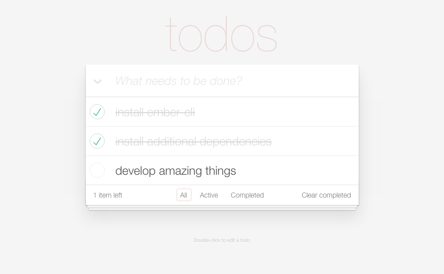
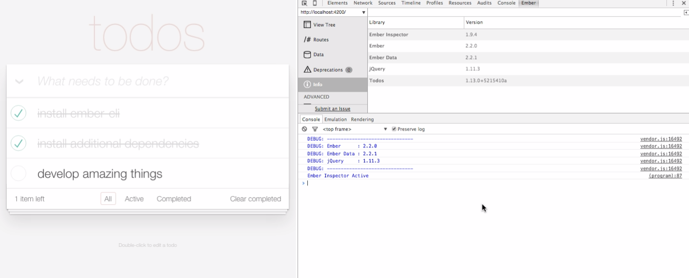
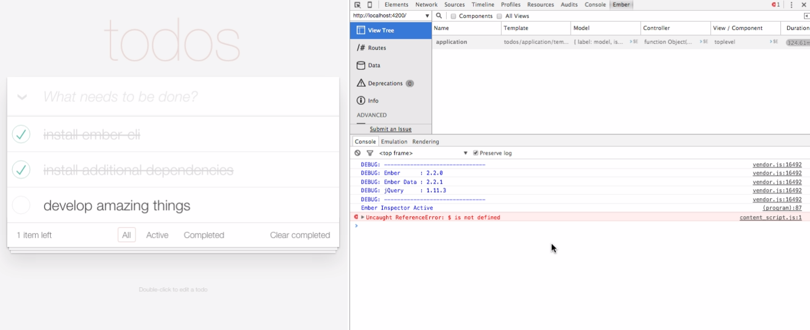
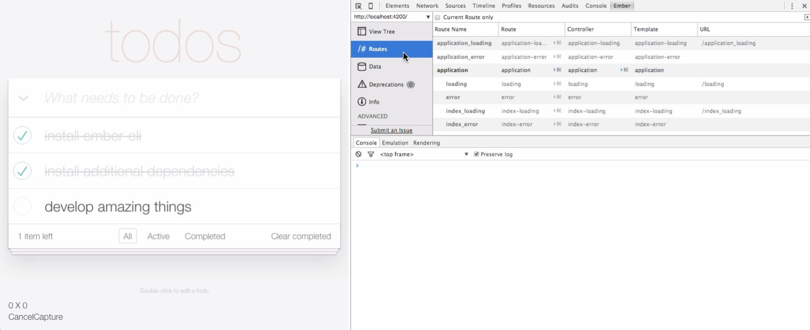
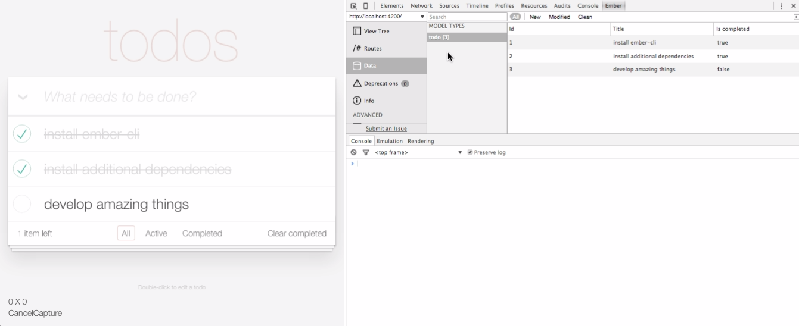
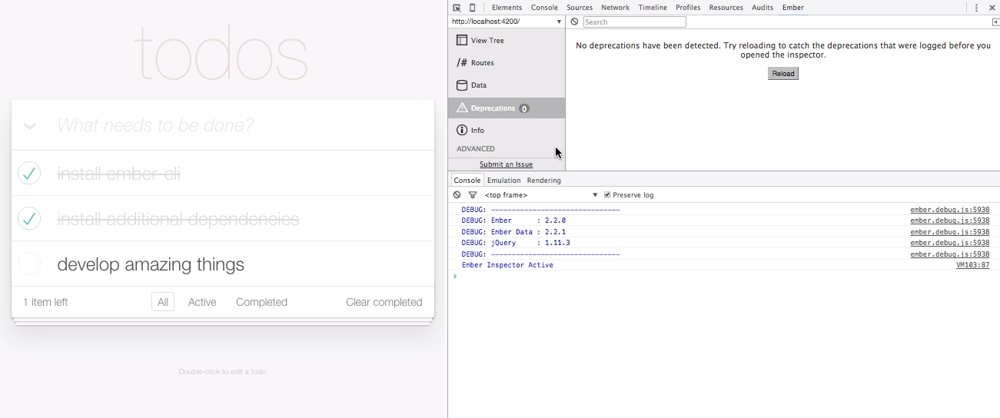

# Ember Inspector

Now that you've seen a basic Ember application and have discussed all of the
 different components that go into it, let's look at a useful tool that will
 prove invaluable when you build your own applications: the Ember Inspector.

## Foundations

By now, you have already learned how to:

-   Create a new Ember application from the console.
-   Identify different parts of an Ember application and explain what they do.

## Objectives

By the end of this session, you should be able to:

-   Set up the Ember Inspector browser extension.
-   Get top-level information about the application using the Info tab.
-   Inspect an application's View nesting (as well as Models, Controllers, and
     Templates loaded for that View) using the View Tree.
-   Dive deep on individual Routes using the Routes list.
-   Look through data store using the Data tab.

## Setup

The Ember Inspector can be downloaded from the [Chrome Web Store](https://chrome.google.com/webstore/detail/ember-inspector/bmdblncegkenkacieihfhpjfppoconhi)
 (or, if you're using FireFox, you can download it as an [add-on](https://addons.mozilla.org/en-US/firefox/addon/ember-inspector/)
 ).
Setup is a breeze!

Now that we have our tool, let's look at an
 [actual working Ember application](https://github.com/ember-cli/ember-cli-todos)
 (included in this repo for your convenience) and play around with it in the
 Inspector.

If you haven't already, please fork and clone this repository.
Then, run `npm install` and `bower install` to download all dependencies.
Finally, run `ember serve` to launch the actual application.
If you see get a message in the console that looks like

```bash
Build successful - 9951ms.

Slowest Trees                                 | Total
----------------------------------------------+---------------------
ConcatWithMaps                                | 6567ms

Slowest Trees (cumulative)                    | Total (avg)
----------------------------------------------+---------------------
ConcatWithMaps (4)                            | 6622ms (1655 ms)
Babel (4)                                     | 1088ms (272 ms)
```

then you've done it right.
Go to `http://localhost:4200` in Chrome, where you should see a page like this:



Then, open up the Chrome Inspector, and go to the tab labelled 'Ember'.

## Using the Inspector

### Info Tab



The info tab is where you can find version information for the key libraries in
 your Ember application (Ember, Ember Data, jQuery) as well as the version of
 Ember Inspector itself.
Otherwise, not a whole lot to do here.

### View Tree Tab



The 'View Tree' tab shows all of the Views in your application.
As you'll recall, Views are JS objects that map to Handlebars templates that
 nest inside each other on the page; as a result, it's also possible to
 represent the full set of Views in your application as a tree, with the
 outermost View, 'application', all the way at the top.

This particular app only has one View, so we can't see the tree structure very
 easily.
However, if we had two other Views nested inside 'application', they would show
 up underneath it.

If you click one of the cells in the 'View' column, it will pop up a sidebar on
 the right displaying all of the properties for that particular View.

See that `>$E` thing on the right side of the cells in the Model, Controller,
 and View columns?
That link will copy the contents of that cell into the console, inside a
 variable called `$E`, allowing you to interact with it.
Take note that these objects will usually have a _lot_ of properties and
 methods, most of which you don't ever manipulate directly - they're part of
 the inner machinery of how Ember works.
Where applicable, this lesson will point out specific properties that you might
 want to look out for.
For instance, if you send the Model to `$E`, you can run the following script in
 the console to print out the names of all the tasks in our to-do list.

`$E.all.forEach(function(todo){console.log(todo.get('title'))})`

### Routes Tab



The 'Routes' tab allows you to look at all of the routes in your application
 that users can hit.
This includes routes that were auto-generated by Ember, such as
 'application_loading' and 'application_error'.

> The purpose of '\_loading' and '\_error' Routes is to customize what the users
> see when they're transitioning between pages; by default, if views are not
> specified for these Routes

Much of this content is similar to the content that you can see on the
 'View Tree' tab.
However, it's worth noting that Route Objects are _only_ visible on the 'Routes'
 tab, while Models are _not_ directly visible.

Similar to the 'View Tree' tab, the 'Routes' tab allows us to zoom in on Route
 Objects and Controllers via a sidebar on the right.

### Data Tab



The 'Data' is a very useful one - it shows every model instance that'd been
 created by your application (split up by Model) along with all of its
 properties.
Naturally, this is very useful for making sure that your data all look correct.

### Deprecations Tab



The 'Deprecations' functions as a sort of linter for your Ember code, giving
 you warnings about particular expressions, idioms, or tools that will soon be
 phased out.
Since Ember is a very new framework (initially released in December 2011),
 updates are common, so being able to keep tabs on the differences between one
 version of Ember and the next is very important.

## YOUR TURN :: Explore the Ember Inspector

Take the next 10 minutes to play around with this app in the Ember Inspector.
If you notice anything interesting, write it down - we'll take five minutes to
 share out to the rest of the class at the end of the exercise.

## Additional Resources

-   [Source code for Ember Inspector](https://github.com/emberjs/ember-inspector)

## [License](LICENSE)

Source code distributed under the MIT license. Text and other assets copyright
General Assembly, Inc., all rights reserved.
